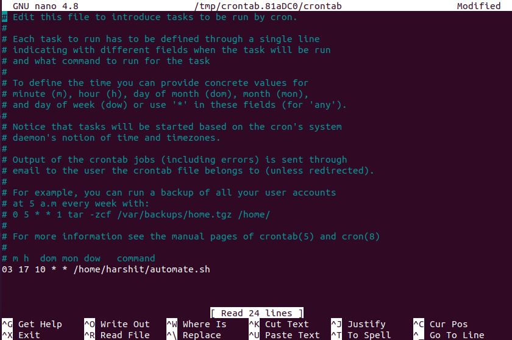

# Automate Joining Zoom Meeting Using Crontab
1. Open your terminal (bash shell) and make a file automate.md
    ```bash
    ~$ nano automate.sh
    ```
2. Insert the following text in automate.sh (Bash Script)
    ```bash
    !/bin/bash 
    export DISPLAY=:0 && firefox --new-window https://us04web.zoom.us/j12345678901pwd=ABFkWGNpQ29EbWdLMlArRDNlUzlvQT09
    ```
    Change the zoom id (`12345678901`) and password (`ABFkWGNpQ29EbWdLMlArRDNlUzlvQT09`) to your meeting.

    Save the file by pressing ```ctrl+X```, press enter and then close it by pressing ```ctrl+O```.
3. Make the file create as executable by running
    ```bash
    ~$ chmod +x /home/harshit/automate.sh
    ```
4. Install crontab if it isn't installed on your computer. For debian based Operating Systems type
    ```bash
    sudo apt-get install crontab
    ```
5. Run this command to see what cronjobs you already have, if any
    ```bash
    crontab -l
    ```
6. Now, the cron job is made out of timings and path to script, it could look like this:
    ```
    30 16 * * 1-5 /home/harshit/automate.sh
    ```
    Cron schedule is made out of 5 spots for different time-related data. 
    ```
    * * * * * command

    (from left-to-right)
    * - minute (0-59)
    * - hour (0-23)
    * - day of the month (1-31)
    * - month (1-12)
    * - day of the week (0-6, 0 is Sunday)
    command - command to execute
    ```
    So, the command above would run every day at 16:30 PM.

    I'd recommend [this handy tool](https://crontab.guru/#28_9_*_*_1-5) for figuring out what output you need.
7. Schedule a new job for automating zoom meeting
    ```bash
    crontab -e
    ```
    Press 1 or enter (default), this open a file in nano scroll down to bottom
    and type below
    \# m h  dom mon dow   command
    ```bash
     30 16 * * 1-5 /home/harshit/automate.sh
    ```
    Save the file by pressing ```ctrl+X```, press enter and then close it by pressing ```ctrl+O```.

    
8. Finally, the script `automate.sh` will get triggered every day form Monday to Friday at 16:30 PM your local time.
